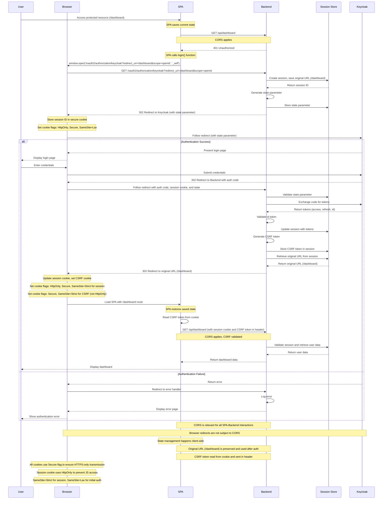
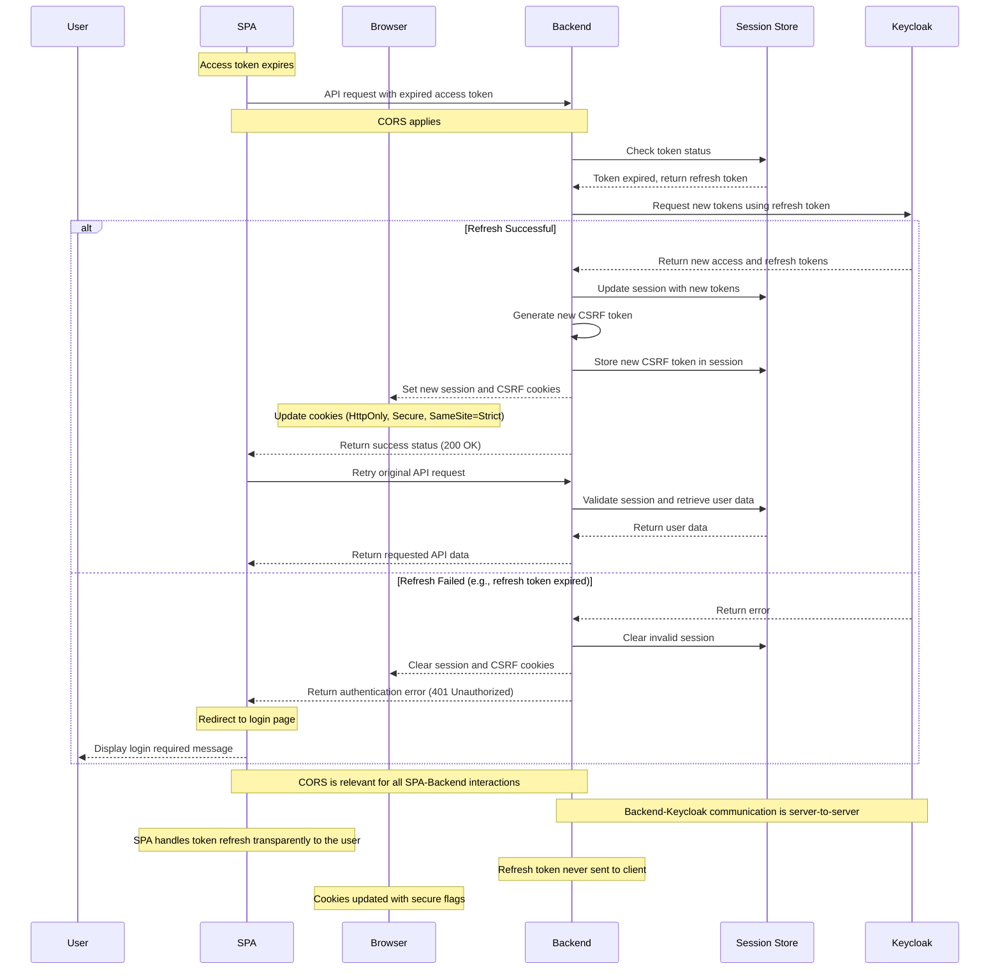

# Complex Diagrams

> MarkView supports complex Mermaid diagrams with interactive features like zooming and panning.

## Features

- Click the expand button (top-right corner of diagram) to **Open Fullscreen** view
- In fullscreen mode:
  - **Zoom In/Out**: Use the +/- buttons or mouse wheel
  - **Pan**: Click and drag to move around
  - **Reset View**: Click the reset button to return to original size
  - **Close**: Click the X button or press ESC key
- **Print-friendly**: Try printing this page (Ctrl+P / Cmd+P) - the expand buttons and modal should be hidden, and diagrams should print cleanly.

---

## HTTP 401 + Client-initiated

---

## Refresh Token Flow

